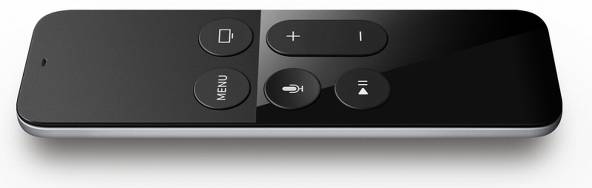

# Apple TV Remote - Custom Lovelace card

A custom Lovelace card to control Apple TV from your Home Assistant dashboard.

This custom card for Lovelace dashboard, intends to mimick the look and feel of a real Apple TV remote (older
generation) as depicted in below picture.

## Action Options

| Name   | Type   | Requirement  | Description           | Default |
|--------|--------|--------------|-----------------------|---------|
| entity | string | **Required** | Entity of type remote | `null`  |

## Installation

### Step 1

Copy `dist/apple-tv-remote.js` into `<config directory>/www/` on your Home Assistant instance.

### Step 2

Add a new Resource to Home Assistant of type `module` and URL `/local/apple-tv-remote.js`.

### Step 3

Add as custom card using `type: custom:apple-tv-remote`, or using the Lovelace UI.

